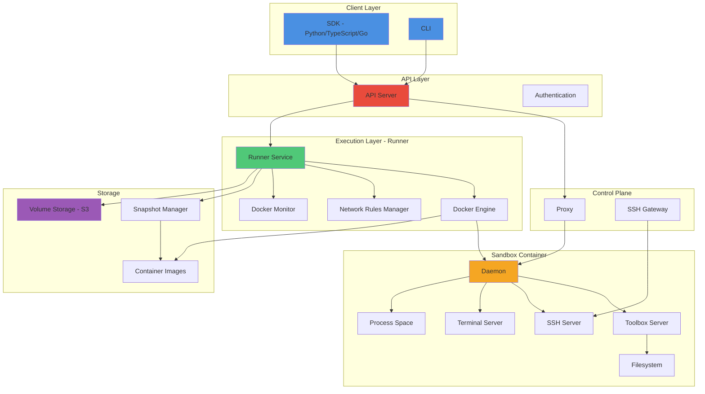
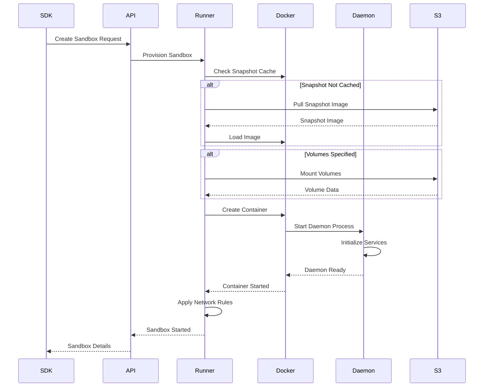
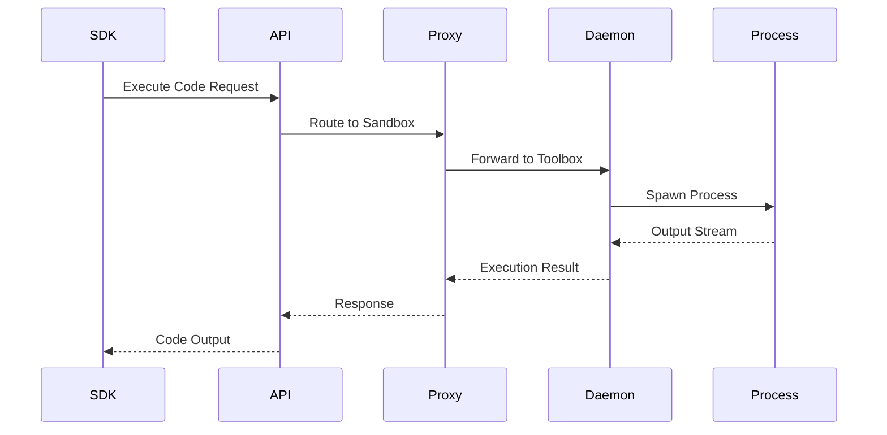
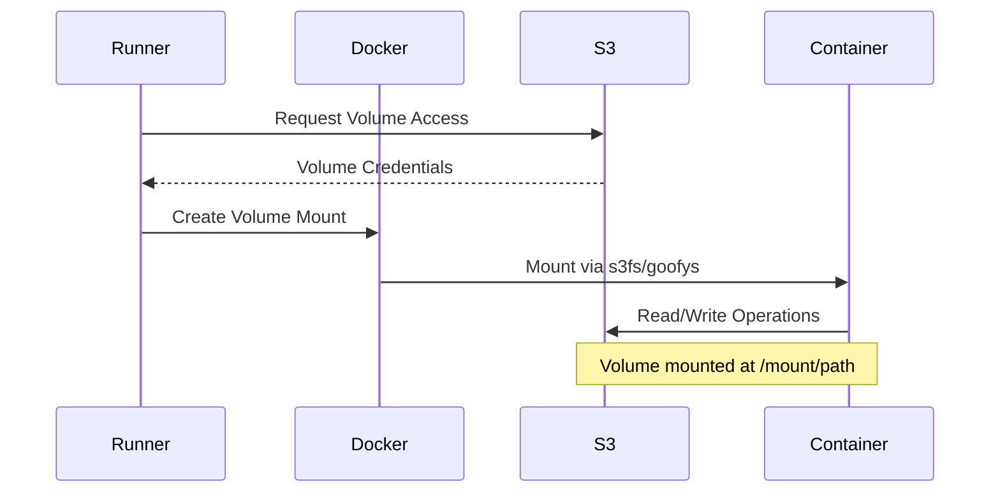

## Overview

Daytona's architecture is designed for massive parallelization, sub-90ms sandbox creation, and secure isolation of AI-generated code execution. The system consists of four primary components that work together to provide a complete platform for running code in isolated environments.

## System Architecture

The Daytona platform follows a distributed architecture with clear separation of concerns:



## Core Components

### API Server

The API Server is the primary entry point for all client interactions.

**Responsibilities:**
- Authenticate and authorize requests
- Manage sandbox lifecycle operations
- Coordinate snapshot and volume management
- Route requests to appropriate runners
- Handle WebSocket connections for real-time updates

**Key Features:**
- RESTful HTTP API
- WebSocket support for live logs and events
- TLS/HTTPS support
- Token-based authentication
- Rate limiting and quota management

**Technology:**
- Built with TypeScript/Node.js
- Runs as a stateless service
- Horizontally scalable

```typescript
// API handles requests from SDKs
POST   /api/v1/sandboxes          // Create sandbox
GET    /api/v1/sandboxes/:id      // Get sandbox details
DELETE /api/v1/sandboxes/:id      // Delete sandbox
POST   /api/v1/sandboxes/:id/start    // Start sandbox
POST   /api/v1/sandboxes/:id/stop     // Stop sandbox
```

### Runner

The Runner is the execution engine that manages Docker containers and sandbox lifecycle on compute nodes.

**Responsibilities:**
- Create and manage Docker containers for sandboxes
- Handle snapshot building and pulling
- Manage volume mounting and unmounting
- Enforce resource quotas (CPU, memory, GPU, disk)
- Monitor container health and state
- Implement network isolation rules
- Collect metrics and telemetry

**Key Features:**
- Docker container orchestration
- Resource limits enforcement
- Network policy management with iptables
- Volume cleanup and maintenance
- Snapshot caching for fast startup
- State synchronization with API

**Technology:**
- Built with Go
- Interfaces with Docker Engine API
- Manages iptables for network isolation
- Integrates with S3 for volume storage

**Architecture:**
```go
// Runner main components
type Runner struct {
    Docker            *DockerClient        // Container management
    NetRulesManager   *NetRulesManager     // Network isolation
    MetricsCollector  *MetricsCollector    // Resource monitoring
    StatesCache       *Cache               // State synchronization
    SandboxService    *SandboxService      // Sandbox operations
    SSHGatewayService *SSHGatewayService   // SSH access
}
```

**Services:**

<Accordion title="Docker Client">
Manages all Docker operations:
- Container creation and lifecycle
- Image pulling and caching
- Volume mounting via S3
- Resource limit configuration
- Network namespace setup
</Accordion>

<Accordion title="Network Rules Manager">
Enforces network isolation:
- Creates iptables rules per sandbox
- Implements allow/deny lists
- Blocks network access when required
- Cleans up rules on sandbox deletion
</Accordion>

<Accordion title="Metrics Collector">
Monitors sandbox resources:
- CPU usage tracking
- Memory consumption
- Disk I/O metrics
- Network bandwidth
- GPU utilization
</Accordion>

<Accordion title="Sandbox Sync Service">
Synchronizes sandbox state:
- Polls Docker for container status
- Updates API with current states
- Handles state transitions
- Detects and reports errors
</Accordion>

### Daemon

The Daemon runs inside each sandbox container and provides the execution environment.

**Responsibilities:**
- Execute user code and commands
- Provide file system access
- Handle SSH connections
- Manage terminal sessions
- Support Language Server Protocol (LSP)
- Execute entrypoint commands
- Graceful shutdown handling

**Key Features:**
- Toolbox server for code execution and file operations
- SSH server on port 22
- Terminal server on port 22222
- LSP server for code intelligence
- Process management and monitoring
- Session recording support

**Technology:**
- Built with Go
- Statically compiled binary injected into containers
- Minimal resource footprint
- Supports graceful termination

**Services:**

```go
// Daemon components
func main() {
    // Toolbox server - primary interface
    toolBoxServer := toolbox.NewServer(config)
    go toolBoxServer.Start()  // Port 21111
    
    // Terminal server - interactive access
    go terminal.StartTerminalServer(22222)
    
    // SSH server - secure shell access
    sshServer := &ssh.Server{WorkDir: workDir}
    go sshServer.Start()  // Port 22
    
    // Recording dashboard - session playback
    go recordingdashboard.NewDashboardServer().Start()
    
    // Execute entrypoint command if provided
    if len(args) > 0 {
        entrypointCmd = exec.Command(args[0], args[1:]...)
        entrypointCmd.Start()
    }
}
```

<Accordion title="Toolbox Server">
Provides programmatic access:
- Code execution API
- File system operations (read, write, delete)
- Git operations
- LSP integration
- Process management
- Environment variable access
</Accordion>

<Accordion title="SSH Server">
Enables secure shell access:
- Key-based authentication
- Interactive shell sessions
- SCP/SFTP file transfer
- Port forwarding
</Accordion>

<Accordion title="Terminal Server">
Supports browser-based terminals:
- WebSocket-based communication
- Multiple concurrent sessions
- TTY emulation
- Session recording
</Accordion>

### Proxy

The Proxy routes HTTP/WebSocket traffic to sandbox daemons for file operations and code execution.

**Responsibilities:**
- Route requests to specific sandbox instances
- Load balance across multiple sandbox connections
- Handle WebSocket upgrades for real-time communication
- Manage connection pooling
- Support build logs streaming

**Key Features:**
- Dynamic routing based on sandbox ID
- WebSocket support for bidirectional communication
- Connection health monitoring
- Automatic failover
- TLS termination

**Technology:**
- Built with Go
- Reverse proxy implementation
- Supports both HTTP and WebSocket protocols

**Routing:**
```
Client Request → Proxy → Sandbox Daemon (Toolbox Server)

POST /sandbox/:id/execute  → Sandbox :id Toolbox (port 21111)
WS   /sandbox/:id/terminal → Sandbox :id Terminal (port 22222)
GET  /snapshot/:id/build   → Snapshot Build Logs
```

## Data Flow

### Sandbox Creation Flow



### Code Execution Flow



### Volume Mounting Flow



## Network Architecture

### Network Isolation

Each sandbox runs in an isolated network namespace:

```
┌─────────────────────────────────────┐
│           Host Network              │
│  ┌──────────────────────────────┐  │
│  │   Docker Bridge Network      │  │
│  │                              │  │
│  │  ┌────────────────────────┐ │  │
│  │  │   Sandbox Container    │ │  │
│  │  │                        │ │  │
│  │  │  Network Namespace     │ │  │
│  │  │  ┌──────────────────┐ │ │  │
│  │  │  │  iptables Rules  │ │ │  │
│  │  │  │  - Allow List    │ │ │  │
│  │  │  │  - Block All     │ │ │  │
│  │  │  └──────────────────┘ │ │  │
│  │  │                        │ │  │
│  │  │  eth0: 172.17.x.x     │ │  │
│  │  └────────────────────────┘ │  │
│  └──────────────────────────────┘  │
└─────────────────────────────────────┘
```

**Network Rules Manager** creates iptables rules:

```bash
# Block all outbound traffic (when network_block_all=true)
iptables -A OUTPUT -o eth0 -j DROP

# Allow specific CIDR ranges (when network_allow_list set)
iptables -A OUTPUT -d 10.0.0.0/8 -j ACCEPT
iptables -A OUTPUT -d 172.16.0.0/12 -j ACCEPT

# Allow localhost
iptables -A OUTPUT -o lo -j ACCEPT
```

### Port Mapping

```
Sandbox Container:
- 22:     SSH Server (external access via SSH Gateway)
- 21111:  Toolbox Server (via Proxy)
- 22222:  Terminal Server (via Proxy)
- 3000+:  User application ports (via Proxy if public=true)
```

## Resource Management

### Resource Limits

Runner enforces resource quotas using Docker:

```go
container.HostConfig = &container.HostConfig{
    Resources: container.Resources{
        NanoCPUs:   int64(cpu * 1e9),        // CPU cores
        Memory:     int64(memory * 1024^3),  // Bytes
        DiskQuota:  int64(disk * 1024^3),    // Bytes
        DeviceRequests: []container.DeviceRequest{
            {
                Count:        int(gpu),
                Capabilities: [][]string{{"gpu"}},
            },
        },
    },
}
```

### Metrics Collection

```go
type Metrics struct {
    CPU    float64  // Current CPU usage %
    Memory int64    // Current memory bytes
    Disk   int64    // Current disk bytes
    GPU    float64  // Current GPU usage %
    
    CPULimit    float64  // CPU quota
    MemoryLimit int64    // Memory quota
    DiskLimit   int64    // Disk quota
}
```

## Storage Architecture

### Snapshot Storage

```
┌──────────────────────────────────────┐
│      Container Image Registry        │
│                                      │
│  ┌────────────────────────────────┐ │
│  │  Snapshot Images               │ │
│  │  - Base images (Python, Node)  │ │
│  │  - Custom snapshots            │ │
│  │  - Multi-region replication    │ │
│  └────────────────────────────────┘ │
└──────────────────────────────────────┘
         ↓
┌──────────────────────────────────────┐
│      Runner Local Cache              │
│  - Frequently used snapshots         │
│  - LRU eviction policy               │
└──────────────────────────────────────┘
```

### Volume Storage

```
┌──────────────────────────────────────┐
│      S3-Compatible Storage           │
│                                      │
│  Volumes/                            │
│  ├── vol-123/                        │
│  │   ├── file1.txt                  │
│  │   └── subdir/file2.txt           │
│  └── vol-456/                        │
│      └── data.parquet                │
└──────────────────────────────────────┘
         ↓
┌──────────────────────────────────────┐
│      Sandbox Container               │
│                                      │
│  /mount/path → vol-123 (via s3fs)   │
└──────────────────────────────────────┘
```

## Scaling and Distribution

### Horizontal Scaling

**API Server:**
- Stateless design allows multiple instances
- Load balanced via standard HTTP load balancers
- Shared database for state persistence

**Runner:**
- Each runner manages a pool of compute resources
- Sandboxes distributed across runners
- Runners register with API on startup
- Automatic failover on runner failure

**Proxy:**
- Routes to sandboxes on any runner
- Maintains connection pool per sandbox
- Can be horizontally scaled

### Geographic Distribution

```
┌─────────────┐     ┌─────────────┐     ┌─────────────┐
│   US-EAST   │     │   US-WEST   │     │   EU-WEST   │
│             │     │             │     │             │
│  ┌────────┐ │     │  ┌────────┐ │     │  ┌────────┐ │
│  │ Runner │ │     │  │ Runner │ │     │  │ Runner │ │
│  └────────┘ │     │  └────────┘ │     │  └────────┘ │
│  ┌────────┐ │     │  ┌────────┐ │     │  ┌────────┐ │
│  │   S3   │ │     │  │   S3   │ │     │  │   S3   │ │
│  └────────┘ │     │  └────────┘ │     │  └────────┘ │
└─────────────┘     └─────────────┘     └─────────────┘
       ↑                  ↑                    ↑
       └──────────────────┴────────────────────┘
                         │
                  ┌──────────────┐
                  │  Global API  │
                  └──────────────┘
```

## High Availability

### Component Redundancy

- **API Server**: Multiple instances behind load balancer
- **Runners**: Multiple runners per region
- **Storage**: S3 provides built-in redundancy
- **Snapshots**: Replicated across regions

### Failure Handling

**Sandbox Failure:**
- Detected by Docker monitor
- State updated to "error"
- Error reason captured and reported
- User notified via webhook/API

**Runner Failure:**
- Sandboxes on failed runner marked as "unknown"
- New sandboxes routed to healthy runners
- Failed runner's sandboxes can be recreated

**Network Partition:**
- Sandbox continues running on runner
- State sync resumes when connectivity restored
- Sandboxes not lost during brief outages

## Performance Optimizations

### Snapshot Caching

```go
// Runner caches frequently used snapshots
type SnapshotCache struct {
    cache map[string]*CachedSnapshot
    lru   *LRUEviction
    maxSize int64
}

// Sub-90ms sandbox creation from cached snapshot
if cached := cache.Get(snapshotId); cached != nil {
    // Use cached image - no pull needed
    container.Create(cached.Image)
} else {
    // Pull and cache for next time
    cache.Pull(snapshotId)
}
```

### Connection Pooling

```go
// Proxy maintains connection pool to daemons
type ConnectionPool struct {
    connections map[string]*Connection
    maxIdle     int
    maxActive   int
}

// Reuse connections for multiple requests
if conn := pool.Get(sandboxId); conn != nil {
    return conn.Execute(request)
}
```

### Resource Cleanup

```go
// Periodic cleanup of unused resources
go func() {
    ticker := time.NewTicker(5 * time.Minute)
    for range ticker.C {
        // Clean up orphaned volumes
        cleanupOrphanedVolumes()
        
        // Evict old snapshot images
        snapshotCache.EvictOld()
        
        // Clean up stopped containers
        cleanupStoppedContainers()
    }
}()
```

## Monitoring and Observability

### Telemetry

Daytona integrates with OpenTelemetry:

```go
// Runner exports metrics
type Metrics struct {
    // Sandbox metrics
    SandboxCount      int
    SandboxCreations  int
    SandboxDeletions  int
    
    // Resource metrics
    CPUUsage          float64
    MemoryUsage       int64
    DiskUsage         int64
    
    // Performance metrics
    SnapshotPullTime  time.Duration
    SandboxStartTime  time.Duration
}
```

### Logging

Structured logging throughout the system:

```go
log.WithFields(log.Fields{
    "sandbox_id": sandboxId,
    "state":      newState,
    "duration":   elapsed,
}).Info("Sandbox state transition")
```

## Security Architecture

See [Security](/concepts/security) for detailed security architecture.

## Next Steps

<CardGroup cols={2}>
  <Card title="Security" icon="shield" href="/concepts/security">
    Learn about isolation and security model
  </Card>
  <Card title="Sandboxes" icon="box" href="/concepts/sandboxes">
    Understand sandbox lifecycle and operations
  </Card>
  <Card title="API Reference" icon="code" href="/api-reference">
    Explore the complete API
  </Card>
  <Card title="Self-Hosting" icon="server" href="/self-hosting">
    Deploy Daytona in your infrastructure
  </Card>
</CardGroup>