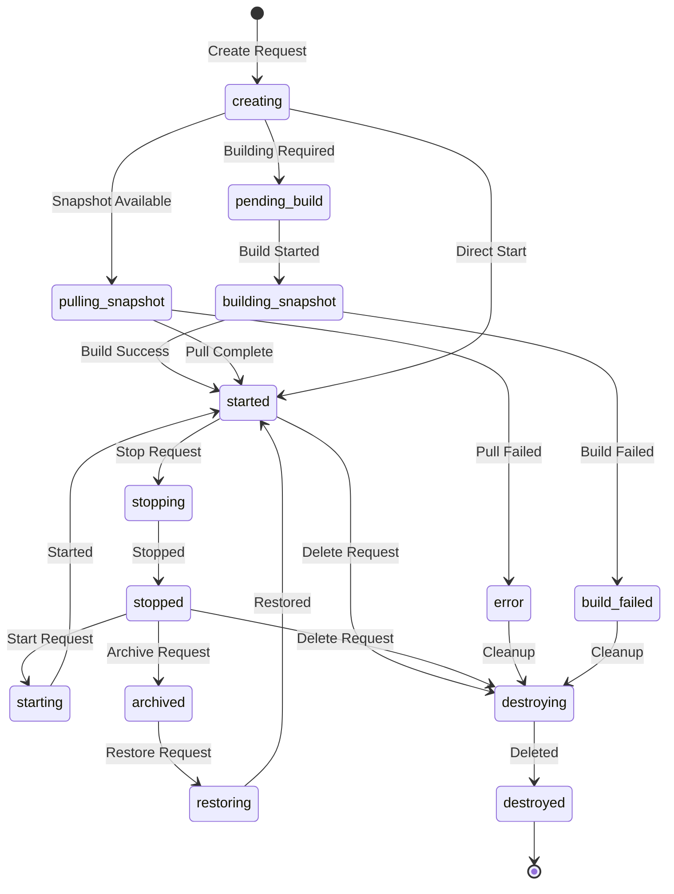

## Overview

Sandboxes are the core primitive in Daytona - isolated, containerized execution environments where AI-generated code runs securely. Each sandbox provides a complete development environment with its own filesystem, process space, and network isolation.

## What is a Sandbox?

A Daytona Sandbox is a lightweight, isolated container instance that provides:

- **Complete Isolation**: Separate filesystem, process space, and network namespace
- **Resource Allocation**: Configurable CPU, memory, GPU, and disk quotas
- **Persistent State**: Sandboxes can be stopped and restarted without losing data
- **Network Control**: Granular network access policies and egress filtering
- **OCI Compatibility**: Built on any OCI/Docker image

<Note>
Sandboxes are designed for sub-90ms creation time, enabling rapid iteration and massive parallelization for AI workflows.
</Note>

## Sandbox Lifecycle

Sandboxes transition through various states during their lifecycle:



### Sandbox States

<Accordion title="All Sandbox States">

| State | Description |
|-------|-------------|
| `creating` | Sandbox is being initialized |
| `pending_build` | Waiting for snapshot build to begin |
| `building_snapshot` | Building snapshot from source |
| `pulling_snapshot` | Pulling snapshot image from registry |
| `started` | Sandbox is running and ready |
| `stopped` | Sandbox is stopped but preserved |
| `starting` | Sandbox is being started |
| `stopping` | Sandbox is being stopped |
| `archived` | Sandbox is archived to storage |
| `restoring` | Sandbox is being restored from archive |
| `resizing` | Sandbox resources are being adjusted |
| `destroying` | Sandbox is being deleted |
| `destroyed` | Sandbox has been removed |
| `error` | Sandbox encountered an error |
| `build_failed` | Snapshot build failed |
| `unknown` | Sandbox state is unknown |

</Accordion>

## Sandbox Configuration

### Resource Allocation

Sandboxes support configurable resource quotas:

```python
from daytona import Daytona, DaytonaConfig, CreateSandboxParams

daytona = Daytona(DaytonaConfig(api_key="YOUR_API_KEY"))

sandbox = daytona.create(CreateSandboxParams(
    language="python",
    cpu=2.0,      # 2 CPU cores
    memory=4.0,   # 4 GB RAM
    gpu=1.0,      # 1 GPU
    disk=10.0     # 10 GB disk
))
```

<Tabs>
  <Tab title="Python">
    ```python
    # Create with custom resources
    sandbox = daytona.create(CreateSandboxParams(
        language="python",
        cpu=4.0,
        memory=8.0
    ))
    ```
  </Tab>
  <Tab title="TypeScript">
    ```typescript
    // Create with custom resources
    const sandbox = await daytona.create({
        language: 'typescript',
        cpu: 4.0,
        memory: 8.0
    });
    ```
  </Tab>
  <Tab title="Go">
    ```go
    // Create with custom resources
    sandbox, err := client.Create(ctx, types.SnapshotParams{
        SandboxBaseParams: types.SandboxBaseParams{
            Language: types.CodeLanguagePython,
            Cpu:      4.0,
            Mem:      8.0,
        },
    })
    ```
  </Tab>
</Tabs>

### Network Configuration

Control network access with fine-grained policies:

- **Network Block All**: Completely isolate the sandbox from external networks
- **Network Allow List**: Specify CIDR ranges for allowed network access
- **Public HTTP Preview**: Enable public access to sandbox HTTP ports

```python
# Create sandbox with restricted network
sandbox = daytona.create(CreateSandboxParams(
    language="python",
    network_block_all=True,
    network_allow_list="10.0.0.0/8,172.16.0.0/12"
))
```

<Warning>
By default, sandboxes have network access. Use `network_block_all=True` for maximum isolation when running untrusted code.
</Warning>

### Environment Variables

Pass configuration and secrets via environment variables:

```python
sandbox = daytona.create(CreateSandboxParams(
    language="python",
    env={
        "DATABASE_URL": "postgresql://...",
        "API_KEY": "secret-key"
    }
))
```

### Labels

Organize sandboxes with custom labels:

```python
sandbox = daytona.create(CreateSandboxParams(
    language="python",
    labels={
        "project": "ml-training",
        "team": "data-science",
        "environment": "production"
    }
))
```

## Sandbox Automation

### Auto-Stop

Automatically stop sandboxes after a period of inactivity:

```python
sandbox = daytona.create(CreateSandboxParams(
    language="python",
    auto_stop_interval=30  # Stop after 30 minutes of inactivity
))
```

### Auto-Archive

Archive stopped sandboxes to reduce costs:

```python
sandbox = daytona.create(CreateSandboxParams(
    language="python",
    auto_archive_interval=60  # Archive after 60 minutes
))
```

### Auto-Delete

Automatically clean up sandboxes:

```python
sandbox = daytona.create(CreateSandboxParams(
    language="python",
    auto_delete_interval=120  # Delete after 120 minutes
))
```

<Info>
Set `auto_delete_interval=0` to delete immediately upon stopping. Use `-1` to disable auto-deletion.
</Info>

## Sandbox Operations

### Starting and Stopping

```python
# Stop a running sandbox
sandbox.stop()

# Start a stopped sandbox
sandbox.start()

# Restart a sandbox
sandbox.restart()
```

### Resizing

Dynamically adjust sandbox resources:

```python
# Resize sandbox resources
sandbox.resize(
    cpu=4.0,
    memory=8.0
)
```

### Deletion

```python
# Delete a sandbox
daytona.delete(sandbox)
```

## Use Cases

### AI Code Execution

Run AI-generated code in isolated environments:

```python
# Create sandbox for AI-generated code
sandbox = daytona.create(CreateSandboxParams(
    language="python",
    network_block_all=True  # Isolate from network
))

# Execute AI-generated code safely
response = sandbox.process.code_run(ai_generated_code)
print(response.result)

# Clean up
daytona.delete(sandbox)
```

### Development Environments

Create on-demand development workspaces:

```python
# Create development environment
sandbox = daytona.create(CreateSandboxParams(
    language="python",
    snapshot="my-dev-snapshot",
    volumes=[{
        "volume_id": "project-data",
        "mount_path": "/workspace"
    }]
))
```

### Testing and CI/CD

Run tests in isolated, reproducible environments:

```python
# Create test environment
sandbox = daytona.create(CreateSandboxParams(
    language="python",
    snapshot="test-environment",
    auto_delete_interval=0  # Delete immediately after tests
))

# Run tests
test_result = sandbox.process.code_run("pytest tests/")

# Cleanup happens automatically
```

### Agent Workspaces

Provide persistent workspaces for AI agents:

```python
# Create agent workspace
agent_sandbox = daytona.create(CreateSandboxParams(
    language="python",
    name="agent-workspace",
    labels={"agent": "code-assistant"},
    auto_stop_interval=60
))

# Agent executes commands
result = agent_sandbox.process.execute_command("git clone ...")
```

## Best Practices

1. **Resource Allocation**: Start with conservative resource quotas and scale up as needed
2. **Network Isolation**: Always use `network_block_all=True` when running untrusted code
3. **Cleanup**: Use auto-delete intervals to prevent resource waste
4. **Snapshots**: Create snapshots of configured environments for faster startup
5. **Labels**: Tag sandboxes with metadata for organization and cost tracking
6. **Volumes**: Use volumes for persistent data that should survive sandbox deletion

## Next Steps

<CardGroup cols={2}>
  <Card title="Snapshots" icon="camera" href="/concepts/snapshots">
    Learn about creating and managing snapshots
  </Card>
  <Card title="Volumes" icon="database" href="/concepts/volumes">
    Understand persistent storage with volumes
  </Card>
  <Card title="Architecture" icon="diagram-project" href="/concepts/architecture">
    Explore Daytona's system architecture
  </Card>
  <Card title="Security" icon="shield" href="/concepts/security">
    Learn about isolation and security
  </Card>
</CardGroup>