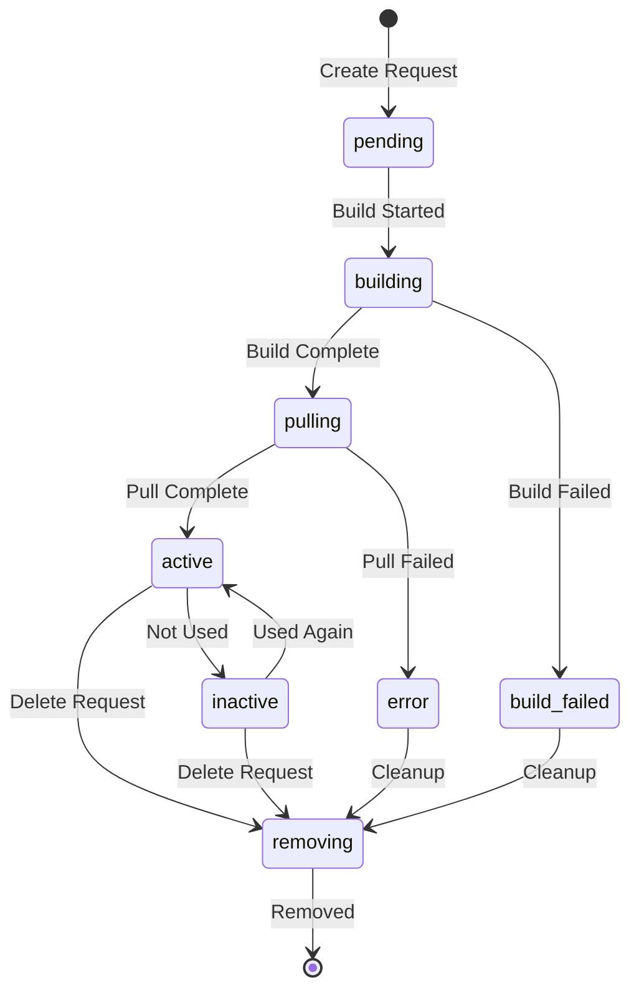

## Overview

Snapshots are pre-built, versioned container images that enable lightning-fast sandbox creation. By building your development environment once and reusing it across multiple sandboxes, you can achieve sub-90ms startup times.

## What is a Snapshot?

A snapshot in Daytona is:

- **Pre-built Image**: A complete container image with your environment configured
- **Reusable Template**: The foundation for creating multiple identical sandboxes
- **Versioned**: Each snapshot has a unique identifier and can be tracked over time
- **Regional**: Snapshots can be distributed across multiple regions for low-latency access
- **Build Info**: Includes metadata about the build source and configuration

<Note>
Snapshots eliminate the build time from sandbox creation, enabling near-instantaneous environment provisioning.
</Note>

## Snapshot Structure

Every snapshot contains:

```typescript
{
  id: string,                    // Unique identifier
  name: string,                  // Human-readable name
  organizationId: string,        // Organization owner
  general: boolean,              // Public vs organization-specific
  state: SnapshotState,          // Current state
  imageName: string,             // Container image reference
  size: number,                  // Image size in bytes
  entrypoint: string[],          // Container entrypoint command
  cpu: number,                   // Default CPU allocation
  gpu: number,                   // Default GPU allocation
  mem: number,                   // Default memory allocation
  disk: number,                  // Default disk allocation
  buildInfo: BuildInfo,          // Build source and config
  regionIds: string[],           // Available regions
  createdAt: Date,               // Creation timestamp
  updatedAt: Date,               // Last update timestamp
  lastUsedAt: Date               // Last usage timestamp
}
```

## Snapshot States

Snapshots progress through the following states:



<Accordion title="Snapshot State Definitions">

| State | Description |
|-------|-------------|
| `pending` | Snapshot creation requested, waiting to start build |
| `building` | Snapshot is being built from source |
| `pulling` | Snapshot image is being pulled to runner |
| `active` | Snapshot is ready and available for use |
| `inactive` | Snapshot exists but hasn't been used recently |
| `error` | Snapshot encountered an error |
| `build_failed` | Snapshot build process failed |
| `removing` | Snapshot is being deleted |

</Accordion>

## Creating Snapshots

### From a Sandbox

The most common way to create a snapshot is from an existing sandbox:

<Tabs>
  <Tab title="Python">
    ```python
    from daytona import Daytona, DaytonaConfig, CreateSandboxParams

    daytona = Daytona(DaytonaConfig(api_key="YOUR_API_KEY"))

    # Create and configure a sandbox
    sandbox = daytona.create(CreateSandboxParams(language="python"))

    # Install dependencies and configure environment
    sandbox.process.execute_command("pip install pandas numpy scikit-learn")
    sandbox.fs.write_file("/workspace/config.json", config_data)

    # Create snapshot from configured sandbox
    snapshot = sandbox.create_snapshot(name="ml-environment-v1")

    print(f"Snapshot created: {snapshot.id}")
    ```
  </Tab>
  <Tab title="TypeScript">
    ```typescript
    import { Daytona } from '@daytonaio/sdk';

    const daytona = new Daytona({ apiKey: 'YOUR_API_KEY' });

    // Create and configure a sandbox
    const sandbox = await daytona.create({ language: 'typescript' });

    // Install dependencies and configure environment
    await sandbox.process.executeCommand('npm install express axios');
    await sandbox.fs.writeFile('/workspace/config.json', configData);

    // Create snapshot from configured sandbox
    const snapshot = await sandbox.createSnapshot({ 
      name: 'node-api-v1' 
    });

    console.log(`Snapshot created: ${snapshot.id}`);
    ```
  </Tab>
  <Tab title="Go">
    ```go
    import (
        "context"
        "github.com/daytonaio/daytona/libs/sdk-go/pkg/daytona"
        "github.com/daytonaio/daytona/libs/sdk-go/pkg/types"
    )

    client, _ := daytona.NewClient()
    ctx := context.Background()

    // Create and configure a sandbox
    sandbox, _ := client.Create(ctx, types.SnapshotParams{
        SandboxBaseParams: types.SandboxBaseParams{
            Language: types.CodeLanguagePython,
        },
    })

    // Install dependencies
    sandbox.Process.ExecuteCommand(ctx, "go get github.com/gin-gonic/gin")

    // Create snapshot
    snapshot, _ := sandbox.CreateSnapshot(ctx, types.CreateSnapshotParams{
        Name: "go-api-v1",
    })
    ```
  </Tab>
</Tabs>

### From Build Configuration

Create snapshots directly from a Dockerfile or build configuration:

```python
# Create snapshot from Dockerfile
snapshot = daytona.snapshots.create(
    name="custom-environment",
    build_info={
        "dockerfile": """
        FROM python:3.11-slim
        RUN pip install pandas numpy matplotlib
        WORKDIR /workspace
        """,
        "context": "/path/to/context"
    }
)
```

<Warning>
Snapshot builds can take several minutes depending on the complexity of your environment. Use existing snapshots when possible for faster sandbox creation.
</Warning>

## Using Snapshots

### Creating Sandboxes from Snapshots

Once a snapshot is created, use it to launch sandboxes instantly:

```python
# Create sandbox from snapshot
sandbox = daytona.create(CreateSandboxParams(
    snapshot="ml-environment-v1"
))

# Sandbox is ready immediately with pre-installed dependencies
result = sandbox.process.code_run("import pandas as pd; print(pd.__version__)")
print(result.result)  # Outputs pandas version
```

### Snapshot Versioning

Manage different versions of your environment:

```python
# Create versioned snapshots
v1 = sandbox.create_snapshot(name="api-env-v1.0.0")
v2 = sandbox.create_snapshot(name="api-env-v1.1.0")
v3 = sandbox.create_snapshot(name="api-env-v2.0.0")

# Create sandboxes from specific versions
legacy_sandbox = daytona.create(CreateSandboxParams(snapshot="api-env-v1.0.0"))
current_sandbox = daytona.create(CreateSandboxParams(snapshot="api-env-v2.0.0"))
```

## Snapshot Management

### Listing Snapshots

```python
# List all snapshots
snapshots = daytona.snapshots.list()

for snapshot in snapshots:
    print(f"Name: {snapshot.name}")
    print(f"State: {snapshot.state}")
    print(f"Size: {snapshot.size / 1024 / 1024:.2f} MB")
    print(f"Last used: {snapshot.last_used_at}")
    print("---")
```

### Filtering Snapshots

```python
# Filter by organization
org_snapshots = daytona.snapshots.list(
    organization_id="org-123"
)

# Filter by state
active_snapshots = daytona.snapshots.list(
    state="active"
)
```

### Deleting Snapshots

```python
# Delete a snapshot
daytona.snapshots.delete(snapshot_id="snap-123")

# Delete by name
snapshot = daytona.snapshots.get(name="old-environment")
daytona.snapshots.delete(snapshot.id)
```

<Info>
Deleting a snapshot does not affect running sandboxes created from that snapshot. However, you won't be able to create new sandboxes from the deleted snapshot.
</Info>

## General vs Organization Snapshots

### General Snapshots

General snapshots are publicly available base images:

- Pre-built by Daytona for common languages and frameworks
- Available to all users
- Cannot be modified or deleted
- Examples: `python:3.11`, `node:20`, `go:1.21`

```python
# Use a general snapshot
sandbox = daytona.create(CreateSandboxParams(
    language="python"  # Uses general Python snapshot
))
```

### Organization Snapshots

Organization snapshots are private to your organization:

- Created by you from configured sandboxes
- Only accessible within your organization
- Can be versioned and managed
- Optimized for your specific use cases

```python
# Create organization snapshot
custom_snapshot = sandbox.create_snapshot(
    name="my-org-environment"
)

# Use organization snapshot
sandbox = daytona.create(CreateSandboxParams(
    snapshot="my-org-environment"
))
```

## Snapshot Distribution

### Regional Availability

Snapshots can be distributed across multiple regions for low-latency access:

```python
# Check snapshot regions
snapshot = daytona.snapshots.get("my-snapshot")
print(f"Available in regions: {snapshot.region_ids}")

# Snapshot is automatically pulled to the nearest region when used
sandbox = daytona.create(CreateSandboxParams(
    snapshot="my-snapshot",
    target="us-west-2"  # Snapshot pulled to this region if needed
))
```

## Build Information

Snapshots include metadata about their build source:

```python
snapshot = daytona.snapshots.get("my-snapshot")

if snapshot.build_info:
    print(f"Build source: {snapshot.build_info.source}")
    print(f"Build type: {snapshot.build_info.type}")
    print(f"Build context: {snapshot.build_info.context}")
```

## Use Cases

### Development Environment Standardization

```python
# Create standard development environment
dev_sandbox = daytona.create(CreateSandboxParams(language="python"))

# Configure with team standards
dev_sandbox.process.execute_command("""
    pip install black pylint pytest
    git config --global user.name 'Team Standard'
""")

# Save as team snapshot
team_snapshot = dev_sandbox.create_snapshot(name="team-python-dev")

# All team members use the same environment
member_sandbox = daytona.create(CreateSandboxParams(
    snapshot="team-python-dev"
))
```

### CI/CD Pipeline Environments

```python
# Create test environment snapshot
test_sandbox = daytona.create(CreateSandboxParams(language="node"))
test_sandbox.process.execute_command("""
    npm install -g jest playwright
    apt-get update && apt-get install -y chromium
""")

test_snapshot = test_sandbox.create_snapshot(name="ci-test-env")

# Use in CI pipeline
def run_tests():
    test_sandbox = daytona.create(CreateSandboxParams(
        snapshot="ci-test-env",
        auto_delete_interval=0
    ))
    
    result = test_sandbox.process.execute_command("npm test")
    return result.exit_code == 0
```

### Machine Learning Environments

```python
# Create ML environment with common libraries
ml_sandbox = daytona.create(CreateSandboxParams(
    language="python",
    cpu=4.0,
    memory=16.0,
    gpu=1.0
))

ml_sandbox.process.execute_command("""
    pip install torch torchvision tensorflow keras \
                scikit-learn pandas numpy matplotlib \
                jupyter notebook
""")

ml_snapshot = ml_sandbox.create_snapshot(name="ml-gpu-env")

# Create training sandboxes instantly
training_sandbox = daytona.create(CreateSandboxParams(
    snapshot="ml-gpu-env",
    gpu=2.0,
    memory=32.0
))
```

## Best Practices

1. **Version Snapshots**: Use semantic versioning for snapshot names (e.g., `env-v1.2.3`)
2. **Minimize Size**: Keep snapshots lean by only installing necessary dependencies
3. **Document Changes**: Maintain a changelog of what's included in each snapshot version
4. **Regular Updates**: Periodically rebuild snapshots with updated dependencies
5. **Test Before Promoting**: Test new snapshot versions before making them the default
6. **Cleanup Old Versions**: Remove unused snapshot versions to reduce storage costs
7. **Use General Snapshots**: Start with general snapshots when possible for common use cases

## Performance Optimization

### Snapshot Size

Smaller snapshots = faster pull times:

```dockerfile
# Use multi-stage builds to reduce size
FROM python:3.11 as builder
RUN pip install --user pandas numpy

FROM python:3.11-slim
COPY --from=builder /root/.local /root/.local
ENV PATH=/root/.local/bin:$PATH
```

### Layer Caching

Organize Dockerfile commands to maximize layer reuse:

```dockerfile
# Install system dependencies first (changes rarely)
RUN apt-get update && apt-get install -y git curl

# Install language dependencies next (changes occasionally)
RUN pip install --no-cache-dir requests

# Copy application code last (changes frequently)
COPY . /app
```

## Next Steps

<CardGroup cols={2}>
  <Card title="Sandboxes" icon="box" href="/concepts/sandboxes">
    Learn about creating and managing sandboxes
  </Card>
  <Card title="Volumes" icon="database" href="/concepts/volumes">
    Understand persistent storage with volumes
  </Card>
  <Card title="Architecture" icon="diagram-project" href="/concepts/architecture">
    Explore how snapshots fit into the system
  </Card>
  <Card title="Getting Started" icon="rocket" href="/getting-started">
    Start building with snapshots
  </Card>
</CardGroup>