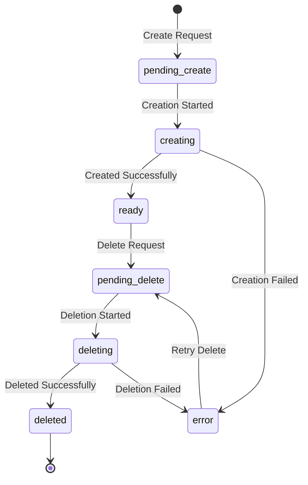

## Overview

Volumes provide persistent, reusable storage that can be attached to sandboxes. Unlike sandbox filesystems that are ephemeral, volumes persist independently and can be mounted across multiple sandboxes, making them ideal for storing data, code, and configurations that need to outlive individual sandbox instances.

## What is a Volume?

A Daytona Volume is:

- **Persistent Storage**: Data persists independently of sandbox lifecycle
- **Reusable**: Can be attached to multiple sandboxes (one at a time)
- **S3-Backed**: Stored in S3-compatible object storage for durability
- **Mountable**: Attached to sandboxes at specific mount paths
- **Subpath Support**: Mount only specific portions of a volume

<Note>
Volumes are backed by S3-compatible storage and mounted into sandbox containers, providing both durability and performance.
</Note>

## Volume Structure

Every volume contains:

```typescript
{
  id: string,                // Unique identifier
  name: string,              // Human-readable name
  organizationId: string,    // Organization owner
  state: VolumeState,        // Current state
  createdAt: string,         // Creation timestamp
  updatedAt: string,         // Last update timestamp
  lastUsedAt: string,        // Last mount timestamp
  errorReason: string        // Error details if applicable
}
```

## Volume States

Volumes transition through the following states:



<Accordion title="Volume State Definitions">

| State | Description |
|-------|-------------|
| `pending_create` | Volume creation requested, waiting to start |
| `creating` | Volume is being created in storage |
| `ready` | Volume is ready to be mounted |
| `pending_delete` | Volume deletion requested, waiting to start |
| `deleting` | Volume is being deleted |
| `deleted` | Volume has been removed |
| `error` | Volume encountered an error |

</Accordion>

## Creating Volumes

### Basic Volume Creation

<Tabs>
  <Tab title="Python">
    ```python
    from daytona import Daytona, DaytonaConfig

    daytona = Daytona(DaytonaConfig(api_key="YOUR_API_KEY"))

    # Create a new volume
    volume = daytona.volumes.create(name="project-data")

    print(f"Volume created: {volume.id}")
    print(f"State: {volume.state}")
    ```
  </Tab>
  <Tab title="TypeScript">
    ```typescript
    import { Daytona } from '@daytonaio/sdk';

    const daytona = new Daytona({ apiKey: 'YOUR_API_KEY' });

    // Create a new volume
    const volume = await daytona.volumes.create({ 
      name: 'project-data' 
    });

    console.log(`Volume created: ${volume.id}`);
    console.log(`State: ${volume.state}`);
    ```
  </Tab>
  <Tab title="Go">
    ```go
    import (
        "context"
        "github.com/daytonaio/daytona/libs/sdk-go/pkg/daytona"
    )

    client, _ := daytona.NewClient()
    ctx := context.Background()

    // Create a new volume
    volume, _ := client.Volumes.Create(ctx, types.CreateVolumeParams{
        Name: "project-data",
    })

    fmt.Printf("Volume created: %s\n", volume.Id)
    ```
  </Tab>
</Tabs>

### Creating with Sandbox

Create a volume and attach it to a sandbox in one operation:

```python
# Create sandbox with new volume
sandbox = daytona.create(CreateSandboxParams(
    language="python",
    volumes=[{
        "name": "workspace-data",  # Creates new volume
        "mount_path": "/workspace"
    }]
))
```

## Mounting Volumes

### Mount to Sandbox

Attach existing volumes to sandboxes:

```python
# Create volume
volume = daytona.volumes.create(name="shared-data")

# Create sandbox with mounted volume
sandbox = daytona.create(CreateSandboxParams(
    language="python",
    volumes=[{
        "volume_id": volume.id,
        "mount_path": "/data"
    }]
))

# Volume is now accessible at /data in the sandbox
sandbox.process.execute_command("ls -la /data")
```

### Multiple Mount Paths

Mount different volumes at different paths:

```python
# Create multiple volumes
code_volume = daytona.volumes.create(name="code")
data_volume = daytona.volumes.create(name="data")
config_volume = daytona.volumes.create(name="config")

# Mount all volumes
sandbox = daytona.create(CreateSandboxParams(
    language="python",
    volumes=[
        {"volume_id": code_volume.id, "mount_path": "/workspace"},
        {"volume_id": data_volume.id, "mount_path": "/data"},
        {"volume_id": config_volume.id, "mount_path": "/config"}
    ]
))
```

### Subpath Mounting

Mount only specific subdirectories within a volume:

```python
# Create volume with multiple projects
volume = daytona.volumes.create(name="multi-project")

# Sandbox 1: Mount only project-a
sandbox_a = daytona.create(CreateSandboxParams(
    language="python",
    volumes=[{
        "volume_id": volume.id,
        "mount_path": "/workspace",
        "subpath": "project-a"  # Only mounts /project-a from volume
    }]
))

# Sandbox 2: Mount only project-b
sandbox_b = daytona.create(CreateSandboxParams(
    language="python",
    volumes=[{
        "volume_id": volume.id,
        "mount_path": "/workspace",
        "subpath": "project-b"  # Only mounts /project-b from volume
    }]
))
```

<Info>
Subpath mounting is useful for isolating different projects or datasets within the same volume while maintaining a single storage resource.
</Info>

## Volume Management

### Listing Volumes

```python
# List all volumes
volumes = daytona.volumes.list()

for volume in volumes:
    print(f"Name: {volume.name}")
    print(f"ID: {volume.id}")
    print(f"State: {volume.state}")
    print(f"Last used: {volume.last_used_at}")
    print("---")
```

### Getting Volume Details

```python
# Get specific volume
volume = daytona.volumes.get(volume_id="vol-123")

print(f"Name: {volume.name}")
print(f"State: {volume.state}")
print(f"Created: {volume.created_at}")
print(f"Last used: {volume.last_used_at}")
```

### Deleting Volumes

```python
# Delete a volume
daytona.volumes.delete(volume_id="vol-123")

# Delete by name
volume = daytona.volumes.get(name="old-data")
daytona.volumes.delete(volume.id)
```

<Warning>
Deleting a volume permanently removes all data stored in it. Ensure you have backups before deletion. Volumes cannot be deleted while mounted to a running sandbox.
</Warning>

## Data Persistence Patterns

### Workspace Persistence

Maintain project state across sandbox sessions:

```python
# Create workspace volume
workspace = daytona.volumes.create(name="my-project")

# Day 1: Initialize project
sandbox1 = daytona.create(CreateSandboxParams(
    language="python",
    volumes=[{"volume_id": workspace.id, "mount_path": "/workspace"}]
))
sandbox1.process.execute_command("git clone https://github.com/user/repo /workspace")
sandbox1.stop()

# Day 2: Continue working (data persists)
sandbox2 = daytona.create(CreateSandboxParams(
    language="python",
    volumes=[{"volume_id": workspace.id, "mount_path": "/workspace"}]
))
# /workspace still contains the cloned repo
sandbox2.process.execute_command("cd /workspace && git pull")
```

### Data Pipeline Storage

Store intermediate results between pipeline stages:

```python
# Create pipeline data volume
pipeline_data = daytona.volumes.create(name="pipeline-storage")

# Stage 1: Data collection
stage1 = daytona.create(CreateSandboxParams(
    language="python",
    volumes=[{"volume_id": pipeline_data.id, "mount_path": "/data"}]
))
stage1.process.code_run("""
import pandas as pd
df = pd.read_csv('source.csv')
df.to_parquet('/data/processed.parquet')
""")
stage1.delete()

# Stage 2: Analysis (reads from same volume)
stage2 = daytona.create(CreateSandboxParams(
    language="python",
    volumes=[{"volume_id": pipeline_data.id, "mount_path": "/data"}]
))
stage2.process.code_run("""
import pandas as pd
df = pd.read_parquet('/data/processed.parquet')
results = df.describe()
results.to_csv('/data/summary.csv')
""")
```

### Configuration Management

Share configuration across multiple sandboxes:

```python
# Create configuration volume
config_vol = daytona.volumes.create(name="shared-config")

# Initialize configuration in one sandbox
setup = daytona.create(CreateSandboxParams(
    language="python",
    volumes=[{"volume_id": config_vol.id, "mount_path": "/config"}]
))
setup.fs.write_file("/config/app.yaml", config_content)
setup.fs.write_file("/config/secrets.env", secrets_content)
setup.delete()

# Use configuration in multiple sandboxes
for i in range(5):
    worker = daytona.create(CreateSandboxParams(
        language="python",
        volumes=[{"volume_id": config_vol.id, "mount_path": "/config"}]
    ))
    # All workers have access to the same configuration
    worker.process.execute_command("cat /config/app.yaml")
```

## Use Cases

### Machine Learning Datasets

```python
# Create volume for ML dataset
dataset_volume = daytona.volumes.create(name="ml-dataset")

# Load data once
data_loader = daytona.create(CreateSandboxParams(
    language="python",
    volumes=[{"volume_id": dataset_volume.id, "mount_path": "/data"}]
))
data_loader.process.code_run("""
import pandas as pd
from sklearn.datasets import load_iris
data = load_iris()
df = pd.DataFrame(data.data, columns=data.feature_names)
df.to_parquet('/data/iris.parquet')
""")

# Multiple training sandboxes share the same data
for model_type in ['svm', 'random_forest', 'neural_net']:
    trainer = daytona.create(CreateSandboxParams(
        language="python",
        volumes=[{"volume_id": dataset_volume.id, "mount_path": "/data"}],
        gpu=1.0
    ))
    trainer.process.code_run(f"python train_{model_type}.py --data /data/iris.parquet")
```

### Multi-Tenant Applications

```python
# Create per-tenant volumes
tenant_volumes = {}
for tenant_id in ['tenant-a', 'tenant-b', 'tenant-c']:
    tenant_volumes[tenant_id] = daytona.volumes.create(
        name=f"tenant-{tenant_id}-data"
    )

# Create isolated sandbox for each tenant
def create_tenant_sandbox(tenant_id):
    return daytona.create(CreateSandboxParams(
        language="python",
        volumes=[{
            "volume_id": tenant_volumes[tenant_id].id,
            "mount_path": "/tenant-data"
        }],
        labels={"tenant": tenant_id}
    ))

# Each tenant's data is isolated
tenant_a_sandbox = create_tenant_sandbox('tenant-a')
tenant_b_sandbox = create_tenant_sandbox('tenant-b')
```

### Code Repository Cache

```python
# Create cache volume for git repositories
repo_cache = daytona.volumes.create(name="git-cache")

# First sandbox clones repos
sandbox1 = daytona.create(CreateSandboxParams(
    language="python",
    volumes=[{"volume_id": repo_cache.id, "mount_path": "/repos"}]
))
sandbox1.process.execute_command("""
git clone https://github.com/large/repo1 /repos/repo1
git clone https://github.com/large/repo2 /repos/repo2
""")

# Subsequent sandboxes use cached repos (faster)
sandbox2 = daytona.create(CreateSandboxParams(
    language="python",
    volumes=[{"volume_id": repo_cache.id, "mount_path": "/repos"}]
))
sandbox2.process.execute_command("cd /repos/repo1 && git pull")  # Fast update
```

## Best Practices

1. **Naming Convention**: Use descriptive names that indicate the volume's purpose
2. **Organization**: Create separate volumes for different types of data (code, data, config)
3. **Cleanup**: Regularly delete unused volumes to reduce storage costs
4. **Subpaths**: Use subpath mounting for multi-tenant or multi-project volumes
5. **Backup**: Important data should be backed up outside of volumes
6. **Access Patterns**: Mount volumes read-only when data should not be modified
7. **Size Management**: Monitor volume usage and clean up old data regularly

## Volume vs Sandbox Filesystem

| Feature | Volume | Sandbox Filesystem |
|---------|--------|--------------------|
| Persistence | Survives sandbox deletion | Lost when sandbox deleted |
| Sharing | Can be mounted to multiple sandboxes | Isolated per sandbox |
| Performance | S3-backed (network) | Container filesystem (fast) |
| Use Case | Long-term storage, shared data | Temporary work, cached data |
| Cost | Charged per GB stored | Included with sandbox |

<Info>
Use volumes for data that needs to persist or be shared. Use the sandbox filesystem for temporary computation and caching.
</Info>

## Performance Considerations

### Volume Access Speed

Volumes are backed by S3, which has different performance characteristics than local disk:

```python
# For best performance, copy frequently accessed data to sandbox filesystem
sandbox.process.execute_command("""
# Copy from volume to local for faster access
cp -r /volume-mount/data /tmp/local-data
# Process from local copy
python process.py --input /tmp/local-data
# Write results back to volume
cp -r /tmp/results /volume-mount/results
""")
```

### Concurrent Access

Volumes can only be mounted to one sandbox at a time:

```python
# This works - sequential access
sandbox1 = daytona.create(CreateSandboxParams(
    volumes=[{"volume_id": vol.id, "mount_path": "/data"}]
))
sandbox1.process.execute_command("process /data")
sandbox1.delete()

# Now another sandbox can mount it
sandbox2 = daytona.create(CreateSandboxParams(
    volumes=[{"volume_id": vol.id, "mount_path": "/data"}]
))
```

## Next Steps

<CardGroup cols={2}>
  <Card title="Sandboxes" icon="box" href="/concepts/sandboxes">
    Learn about creating and managing sandboxes
  </Card>
  <Card title="Snapshots" icon="camera" href="/concepts/snapshots">
    Understand pre-built environments
  </Card>
  <Card title="File Operations" icon="file" href="/features/filesystem-operations">
    Work with files in sandboxes and volumes
  </Card>
  <Card title="Getting Started" icon="rocket" href="/quickstart">
    Start building with volumes
  </Card>
</CardGroup>